<h1 align="center">Misha/thedrhax14</h1>

  Founder-led Senior Full-Stack Engineer, Technical Lead, and Solutions Architect based in Dubai, UAE.

  I build production software across full-stack web systems, backend platforms, enterprise integrations,
  AI-enabled workflows, and browser-based real-time 3D / Unity-connected products.

  <a href="https://thedrhax14.me/">Website</a> •
  <a href="https://www.linkedin.com/in/thedrhax14/">LinkedIn</a>

## GitHub Snapshot

  
  

---

## What I Do

- Ship full-stack products from architecture through production delivery
- Lead client-facing technical discovery, solution design, and implementation
- Build backend systems, internal tools, and complex enterprise integrations
- Deliver real-time interactive products, including browser-based 3D and Unity-connected systems
- Bridge commercial goals with practical engineering execution

## Selected Proof Points

- Nearly 10 years of hands-on software engineering experience
- Founder / technical lead background with 50+ client and event deployments
- Contributed to more than AED 6,000,000 in company revenue through delivery leadership
- Built production systems across Node.js, TypeScript, Python, C#, PHP, Java, Rust, React, Vue, Flutter, and .NET
- Worked on SAML, OIDC, Keycloak, WebRTC, UAE PASS, Odoo ERP, analytics, and cloud / on-prem deployments

## Current Focus

- Forward-deployed engineering
- AI-enabled business software
- Product architecture and delivery rescue
- Enterprise integrations
- Real-time interactive systems

## Tech Areas

**Languages**  
`TypeScript` `JavaScript` `Python` `C#` `Rust` `PHP` `Java` `Dart`

**Frameworks and Platforms**  
`Node.js` `React` `Vue` `Flutter` `.NET` `Unity3D`

**Infrastructure and Data**  
`PostgreSQL` `MySQL` `Docker` `Kubernetes` `GitHub Actions` `Grafana`

**Integration and Product Work**  
`SAML` `OIDC` `Keycloak` `WebRTC` `UAE PASS` `Odoo ERP`

## Featured Work

### HoloFair

Browser-based real-time 3D platform for immersive events, enterprise activations, and interactive digital environments.

My role covered product architecture, full-stack engineering leadership, enterprise integrations, delivery management, and platform quality.

### AgentDesk AI

AI agent platform for business WhatsApp operations that handles FAQs, lead qualification, CRM-connected workflows, bookings, payments, and human approval steps for sensitive actions.

Project page: [AgentDesk AI](https://thedrhax14.me/projects/agentdesk-ai.html)

### Mithqal

Accounting software for jewelry stores with a main web app, on-prem Docker deployment, and auditable employee-attributed transaction workflows.

Project page: [Mithqal](https://thedrhax14.me/projects/mithqal.html)

### LiftMart

Returning client product engagement focused on a version 2 mobile UI refresh, supporting admin additions, and internal testing delivery.

Project page: [LiftMart](https://thedrhax14.me/projects/liftmart.html)

## Open To

- Forward Deployed Engineer roles
- Solutions Architecture work
- Senior Full-Stack or Founding Engineer opportunities
- Technical leadership on product and platform builds
